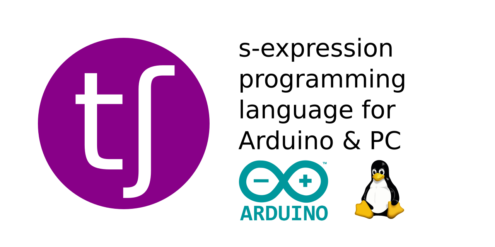

# Chika



*Chika* is a programming language targeting both Arduino as firmware or Linux as an executable. It facilitates high-level round-robin multi-tasking, loading programs from either an SD card or Linux filesystem.  
Its goal is to lean toward agility over both speed and memory footprint, with a unique stack memory model, Lisp-inspired syntax, and MQTT-style internal messaging.  
Its spirit is: decouple everything through inter-task communication.

**[Visit the website](https://phunanon.github.io/Chika) for more information**, including rationale, comparisons to other projects, photos, and more.  
**[Visit the Discord](https://discord.gg/emdhpd5) to chat.**

### Examples

See [core.chi](corpus/programs/core.chi) and the rest of [the corpus](corpus) for more, realistic examples.  
Note: `;//…` is used to make use of Clojure syntax highlighting; comments in Chika are just `//…`.

```clj
;//Calculates Nth term of Fibonacci Sequence
(fn fib n
  (if (< n 3) 1i
    (+ (fib (- n 1)) (fib (- n 2)))))
(fib 35) => 9227465

;//LED blink program for Arduino
(p-mode 32 T)
(fn heartbeat on
  (dig-w 32 on)
  (sleep 1000w)
  (not on))

;//Prints `15`
(print
  (do a= + b= 10 c= 5
    (a b c)))

;//Prints `Hello!`
(fn my-print
  (print str))
(do str= "Hello!"
  (my-print))

;//Filter function, found in core.chi
;//Note: `empty?`, `st`, `append`, and `odd?` are all implemented in Chika in core.chi
;//Note: `out` is an optional argument, as `append` accepts nil as a vector
(fn filter f v ;; out
  (if (empty? v)
    out
    (do next= (st v)
      (recur f (sect v)
        (if (f next)
          (append out next)
          out)))))
(filter odd? [0 1 2 3]) => [1 3]

;//Returns [15 9], using an inline-function with one argument - `#`
(map {# 12 3} [+ -])

;//Subscribes to all inter-program messages to do with displays, and prints their payloads
(sub "display/+" {print #1})
```


### Deployment and compilation

#### Chika VM target: Arduino

Open `Chika_Arduino.ino` in Arduino IDE, upload to your Arduino.  
Ensure there is an SD card inserted with the file `init.kua`. Further programs should be loaded within the `init.kua` file with the `load` operation.

Suitable devices:
- ATSAMD21
  - Arduino MKRZero
  - Adafruit Feather M0
- AVR
  - Arduino Mega 2560

#### Chika VM target: Linux

There are currently a few options for compiling and executing Chika on Linux.  
In the terminal you can run `./compile.sh` to recompile Chika VM for your machine, which also uses the native compiler to recompile `corpus/programs/init.chi`.  
To run a Chika `.chi` source file or `.kua` compiled file you can invoke the `chika` executable with its path, such as: `./chika ../corpus/programs/fibonacci.chi`. This will compile `fibonacci.chi` as `fibonacci.kua` in the executable's working directory.  
Source files can be prepended with a shebang to the Chika executable to execute a `.chi` file directly.


#### Chika compilation

On PC: invoke the `chika` executable such as `./chika c source.chi`. Invoke without the `c` flag to compile and then execute the resulting file.  
On PC/Arduino: use the `comp` op within Chika to compile `.chi` source files.  
Note: it can take a while on the Arduino as it compiles with very limited memory, mostly writing one byte to a file at a time.  
Note: compilation emits many temporary files, which should be deleted after a successful compilation.

### Program lifetime

Each program loaded into the VM has a lifetime of:

- entry
- heartbeat
- messages
- halt

All of these are optional, but at least a heartbeat or entry must be specified in a program.  
Entry is code executed at the program's start, before any heartbeats or messages, and is not contained within any functions. It can call functions *even before* their declaration in the source file. The last entry returned item seeds the program state. Entry code is unloaded after use, so may not be called thereafter.  
Heartbeats are required to stop a program immediately terminating after entry, by including a function called `heartbeat`. This is executed flat-out per program heartbeat function, round-robin style. The `heartbeat` function is passed the program's persisted state as a parameter, and the return is persisted as the new state.  
Messages are broadcast throughout the VM and execute any callback functions, also passed the program's state and returning the new state.

### Written

#### Syntax

Labels and function names can include (almost) any characters excluding whitespace.  
Function names must not start with a digit.

`#num`: first line of file only (or second if a shebang is present). Informs the VM how many bytes of RAM (`num` up to 64KiB) will be used by the program. Otherwise a default maximum is used.

`(func[ N args])`: a form, with a function in the head position, and 0-N arguments separated by spaces. Arguments can be forms.  
Note: `func` can be a native operation, program function, inline-function, binding, extended binding, parameter, or extended parameter.

`(fn func-name[ N params] [1-N forms])`: a function definition, with 0-N parameter symbols separated by spaces, and 1-N forms.  
Note: calling a function with no forms returns nil.

`{form}`: an inline-function, comprised as one form.  
Note: parameters of surrounding functions cannot be referenced within inline-functions. Consider instead using a binding.  
Note: nested inline-functions are forbidden.

`#`: a parameter reference, to the first parameter of a function.  
`$`: an extended parameter reference, to the first parameter of a function's caller function.  
`#N` and `$N`: a parameter reference, to the Nth parameter, e.g. `#3` or `$3` for the fourth parameter of either the function or the function's caller function.  
Note: using `$` when there was no calling function is undefined behaviour.  
Note: the value `$` references can be erased by tail-call optimisation.

`//…`: a comment, which can be suitated on a new line or at the end of one.

`/*…*/`: a multiline comment. Note: an instance of `*/` will terminate a comment immediately, and cannot be contained within a multiline comment itself

`;`: a semicolon, treated as whitespace.

`,`: a comma, treated as whitespace, and whitespace after it is erased.

`…=`: binding, whereby `…` is a label.  
`…`: binding reference, whereby `…` is its label.  
`.…`: an extended binding reference, whereby `…` is its label. It references the previous instance of a binding on the stack.  
Note: parameters take precedent over bindings.  
Note: when *redefining* bindings, one must use an extended binding, so the VM skips the previous instance. Consider: `a= (+ 1 .a)`, so that `a` does not refer to the next item on the stack at that moment - `1`.

The functions `if`, `and`, `or`, and `case` cannot be represented in a binding or parameter.

As functions must only contain forms ensure returns use `val`. 

#### Data types

Note: integers are either in decimal or big-endian hexadecimal format.

- `"…"`: string, whereby `…` are 0 to 128 ASCII characters, or `""` for empty.  
Note: use `\"` and `str` for double-quotations, as strings provide no escaped characters.  
Note: internally strings can be up to 2¹⁶-1 characters long.
- `0` or `0x00`: 8-bit unsigned integer.
- `0w` or `0x0000`: 16-bit unsigned integer.
- `0i` or `0x00000000`: 32-bit signed integer.
- `\c`: ASCII character. Extended: `\nl` newline, `\sp` space.
- `[…]`: vector, whereby `…` are 0 to 2^16 items delimited by space, or `[]` for empty. Syntactic sugar for `(vec …)`

#### Constants

- `args`: emits a vector of function arguments.
- `T`: literal boolean true
- `F`: literal boolean false
- `N`: literal nil

#### Native functions

Note: `[square brackets]` indicate optional arguments.

**Mathematical**

`+` / `-` / `*` / `/` / `mod` / `pow` /  
`&` / `|` / `^` / `<<` / `>>` N arg:  
returns sum / subtraction / multiplication / division / modulus / raise-to-the-power /  
AND / OR / XOR / left shift / right shift of N integers.  
Zero args returns nil. Will cast all parameters as the type of the first argument.  
`~ n`: returns bitwise NOT of `n`.  
Examples: `(+ 1 1) => 2`, `(+ 155 200) => 100`, `(+ 155w 200) => 355w`

**Conditional**

`if cond if-true`: evaluates and returns `if-true` if `cond` is truthy, else nil.  
`if cond if-true if-false`: evaluates and returns `if-true` if `cond` is truthy, else `if-false`.

`case match … N pairs … [default]`: evaluates `match` then compares against the 1st of each pair of arguments, returning the 2nd if the 1st matches; if no matches are made `default` or nil is returned.

`not i`: logically negates item `i`.

`or` N arg: returns first truthy arg.

`and` N arg: returns true if all args truthy.

`=` N arg: equality, true if all args are of the same type, length, and byte equality. Compares ints by value.  
`!=` N arg: negative equality.

`==` N arg: equity, returns true if N items are of byte equality.  
`!==` N arg: negative equity.

`<` / `<=` / `>` / `>=` N arg: returns true if N items are in monotonically increasing / non-decreasing / decreasing / non-increasing order.

**Function related**

`return[ val]`: exit a function early, evaluating to either nil or `val`.

`recur` N arg: on the stack replace the parameters with `N` arguments and recall the function.

`val` 1-N arg: returns its first argument.

`do` 1-N arg: returns its final argument.

**String, vector, and blob related**

`vec` 0 arg: returns empty vector.  
`vec` N arg: returns vector of its arguments.

`nth N i`: returns item or character at index `N` of vector or string `i`, or nil if `N` is in an improper range.

`str` 0 arg: returns empty string.  
`str` N arg: returns concatenation of N arguments as a string.

`len i`: returns either vector, string, or internal item length.

`sect v`: returns `v` with first item (if vector) or character (if string) omitted;  
`sect v skip`: returns `v` with first `skip` items/characters omitted;  
`sect v skip take`: returns `v` with `take` length and first `skip` items/characters omitted;  
`b-sect`: the same as `sect` but returns items/characters burst.

`blob l s`: returns a blob of length `l` with all bytes set to `s`.

`get o l t b`: returns item of type `t` and length `l` from offset `o` bytes of item `b`.  
`get o b`: returns U08 value of byte at offset `o` bytes of item `b`.  
`set o i b`: returns blob `b` with offset `o` bytes set to the bytes of item `i`.  
Note: both `get` and `set` return nil if requested offset + len would exceed the size of the blob.  
Note: both accept a reference as `b` (e.g. `*binding`), and will instead inspect/modify the bytes of the original reference item, `set` returning the reference or nil.

`.. v`: bursts a vector or string `v` onto the argument stack as either vector items or character items.  
Note: like in inversed Clojure `apply` e.g. `(+ (.. [1 2 3]) (.. [4 5 6])) => 21`.  
Note: if its argument is not a vector it leaves no items on the stack.

`binds`: deduplicates any bindings in its arguments, favouring newer ones, and then vectorising the remains.  
Example: `(binds a= 1 b= 2 a= 3) => [b= 2 a= 3]`

**GPIO related**

Note: these have no effect on PC.

`p-mode pin mode`: sets the mode of pin number `pin` to the boolean `mode` - truthy as INPUT, falsey as OUTPUT; returns nil.

`dig-r pin`: returns digital input state of pin number `pin`.

`dig-w [1-N pin val]`: per `pin val`, in succession, sets the digital output state of pin number `pin` to the boolean `val` - truthy or non-zero as HIGH, zero or else LOW; returns nil.

`ana-r pin`: returns analog input state of pin number `pin`.

`ana-w [1-N pin val]`: per `pin val`, in succession, sets the analog/PWM output state of pin number `pin` to the 16-bit integer `val`; returns nil.

`ana-r pin`: returns analog 16-bit integer input of pin number `pin`.

**File IO related**

Note: on Arduino files must have extentions of no more than three characters.

`file-r path`: returns blob of whole file contents.  
`file-r path T`: returns file size.  
`file-r path offset`: returns blob of file content between offset bytes and EOF.  
`file-r path offset count`: returns blob of file content between offset and up to count bytes.  
All return nil upon failure.

`file-a path content`: appends a blob or item as string to file.  
`file-w path content[ offset]`: writes a blob or item as string to a file, optionally with a byte offset (otherwise 0); returns success as boolean.  
Both return success as boolean.  
Note: strings are written without null terminator.

`file-d path`: deletes file at `path`; returns success as boolean.

**Types and casting**

`type i`: returns type code of item `i`.  
`type a b`: returns type code of items `a` & `b` if they are equal, otherwise `nil`.

`cast i t`: returns item `i` cast as type code `t`.  
Note: wider to thinner will be truncated, thinner to wider will be zeroed out;  
string to blob will lack null termination; casts to strings will be appended with null termination.

**Iteration**

`reduce f[ s*N] i`: returns reduction of vector or string `i` through `f`, with 0-N seeds. `f` is `(item acc) => acc`.

`map f v*N`: returns mapping of 1-N vectors through `f`, where `f` is `(item*N) => mapped`.  
Example: `(map str [\a \b \c] [1 2 3]) => [a1 b2 c3]`

`for f v*N`: returns iterative mapping of 1-N vectors through `f`, where `f` is `(item*N) => mapped`.  
Example: `(for str [\a \b \c] [1 2 3]) => [a1 a2 a3 b1 b2 b3 c1 c2 c3]`

`loop n f`: repeats `n` 16-bit number of times the function `f`, where `f` is `(0…n) => any`; returns last return of `f`.  
`loop seed n f`: same as above, but `f` is `(acc 0…n) => any` where `acc` is firstly `seed` then the return of the previous iteration.  
`loop seed a b f`: same as above, except `n` ranges from `a` to `b`.  
Example: `(loop 2 {print "hello" #})` prints "hello0" and "hello1", returns nil.  
Example: `(loop 0 5 +) => 10`.  
Example: `(loop 0 5 10 +) => 35`

**Message related**

Topics are forward-slash (`/`) delimited strings. Un/subscription topics use the wildcards `/+/` for *any* and `/#` for *any hereafter*.  
Example: the topic `house/kitchen/fridge` matches the subcription `house/+/fridge` or `house/#` or `+/kitchen/+` or `#`, but not `garage/#` or `house/bedroom/fridge` or `house/+/sink`.

`pub topic[ payload]`: send a message throughout the VM with the string topic `topic`, and optionally a payload `payload` (otherwise nil) of any type;  
returns nil, or if the message caused another program to publish a message the original publishing program was subscribed to,  
returns the state returned by the original publishing program's subscription handler.  
Note: publishing is immediate and synchronous - your program will have to wait as subscribers process the message.

`sub topic f[ provide-topic]`: subscribe the function `f` to a message topic `topic`,  
where if `provide-topic` is truthy `f` is `(state topic payload) => new-state`,  
else (default) `f` is `(state payload) => new-state`; returns nil.  
Note: only program functions are accepted as `f` - to use a native operation use an inline function.

`unsub topic`: remove previous subscription of `topic`; returns nil.  
`unsub`: drop all program subscriptions; returns nil.

**System & program related**

`ms-now`: returns milliseconds since ChVM initialisation.

`sleep ms`: postpones the program's *next* heartbeat for `ms` miliseconds; returns nil.

`print` 0-N arg: prints result of `str` of N args; returns nil.

`load path`: loads the compiled Chika program at `path` (without file extension); returns bool of success of loading the program.

`comp path-in[ path-out]`: compiles a source file (idiomatically `*.chi`) at `path-in` as a Chika binary, either saved at the same path with the extension changed to `.kua` or at `path-out` (idiomatically `*.kua`).

`halt`: immediately terminates the Chika program.

### Binary structure

A compiled Chika binary is composed solely of **functions**. Functions contain **forms**. Forms contain **args** (which can also be forms) and end with an **operation**. The hexadecimal byte formats are:

**function**  
`NNNNLLLL…`  
`NNNN`, uint16_t incrementing function ID; `LLLL`, uint16_t function body length; `…`, `LLLL`-length function body.

**form**  
`00…args…OO`  
`00`, form marker; `[args]`, 0-N args; `OO` an operation.

**arg**  
or `00…`, a form  
`AA`, uint8_t arg-code; `…` variable-sized bespoke argument body.

**operation**  
`OO`  
`OO`, uint8_t op-code.

### Arg- and Op-codes

00 frm form  
TODO

### Argument formats

TODO
